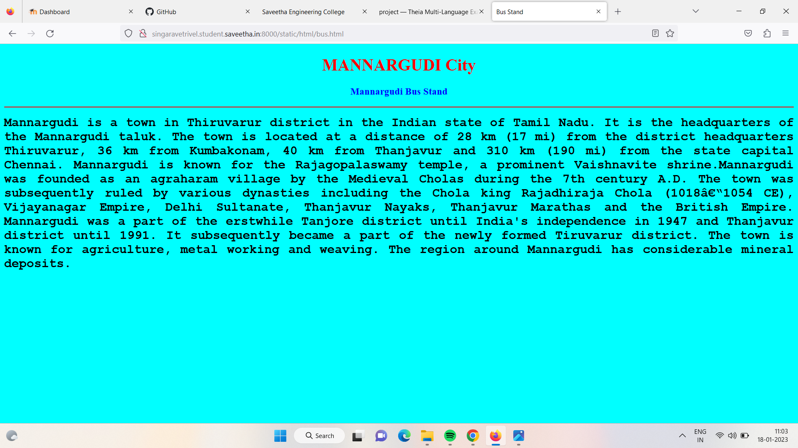

# Places Around Me
## AIM:
To develop a website to display details about the places around my house.

## Design Steps:

### Step 1:
clone the github repository into Theia IDE.

### Step 2:
create a new Django project

### Step 3:
write the needed HTML code.

### Step 4:
Run the Django server and execute the HTML files.

## Code:
```
map.html
<!DOCTYPE html>
<html lang="en">
<head>
<title>My City</title>
</head>
<body>
<h1 align="center">
<font color="red"><b>MANNARGUDI City</b></font>
</h1>
<h3 align="center">
<font color="blue"><b>Singaravetrivel (22004125)</b></font>
</h3>
<center>

<map name="MyCity">
<area shape="circle" coords="190,50,20" href="/static/html/LAS.html" title="LA Cinema shanthi">
<area shape="rectangle" coords="230,30,260,60" href="/static/html/GH.html" title="Government Hospital">
<area shape="circle" coords="400,350,50" href="/static/html/NHSS.html" title="National Higher Secondary School">
<area shape="circle" coords="400,200,75" href="/static/html/bus.html" title="Mannargudi Bus stand">
<area shape="rectangle" coords="490,150,870,320" href="/static/html/HTH.html" title="Thalaivar HOTEL">
</map>
</center>
</body>
</html>

bus.html
<!DOCTYPE html>
<html lang="en">
<head>
<title>Bus Stand</title>
</head>
<body bgcolor="cyan">
<h1 align="center">
<font color="red"><b>MANNARGUDI City</b></font>
</h1>
<h3 align="center">
<font color="blue"><b>Mannargudi Bus Stand</b></font>
</h3>
<hr size="3" color="red">
<p align="justify">
<font face="Courier New" size="5">
<b>
Mannargudi  is a town in Thiruvarur district in the Indian state of Tamil Nadu. It is the headquarters of the Mannargudi taluk. The town is located at a distance of 28 km (17 mi) from the district headquarters Thiruvarur, 36 km from Kumbakonam, 40 km from Thanjavur and 310 km (190 mi) from the state capital Chennai. Mannargudi is known for the Rajagopalaswamy temple, a prominent Vaishnavite shrine.Mannargudi was founded as an agraharam village by the Medieval Cholas during the 7th century A.D. The town was subsequently ruled by various dynasties including the Chola king Rajadhiraja Chola (1018–1054 CE), Vijayanagar Empire, Delhi Sultanate, Thanjavur Nayaks, Thanjavur Marathas and the British Empire. Mannargudi was a part of the erstwhile Tanjore district until India's independence in 1947 and Thanjavur district until 1991. It subsequently became a part of the newly formed Tiruvarur district. The town is known for agriculture, metal working and weaving. The region around Mannargudi has considerable mineral deposits.
</b>
</font>
</p>
</body>
</html>

LAS.html
<!DOCTYPE html>
<html lang="en">
<head>
<title>LAS</title>
</head>
<body bgcolor="yellow">
<h1 align="center">
<font color="red"><b>MANNNARGUDI City</b></font>
</h1>
<h3 align="center">
<font color="blue"><b>LA Cinema Shanthi</b></font>
</h3>
<hr size="3" color="red">
<p align="justify">
<font face="Tahoma" size="5">
Shanti Theatre was built by G. Umapathy and D. Shanmuga Raja,then the Raja of Sivaganga. It was inaugurated on 12 January 1961 by then Chief Minister of Tamil Nadu, K. Kamaraj, and was the first deluxe AC theatre of Madras (now Chennai) with a 1212-seats capacity. The inaugural show was Srinivasa Kalyanam, and the first film to be released there officially was Thooya Ullam, followed by the Hindi film, Kalpana.Paava Mannippu, a Tamil film, was released in Shanti on 16 March 1961. When the film's original promoters were facing a repayment cash crisis, they approached star Sivaji Ganesan who agreed to invest.The theatre had been owned by Ganesan's family ever since. The theatre is widely believed to have been named after Ganesan's daughter Shanti. According to Ganesan's nephew Giri Shanmugam, "Shanti Theatre became a landmark in the city because it was owned by the great Sivaji Ganesan. After Paava Mannippu, the theatre proceeded to screen an additional 81 films starring Ganesan. Some of his films like Paava Mannippu, Thiruvilaiyadal, Vasantha Maligai, Thanga Pathakkam, Thirisoolam and Muthal Mariyathai became silver jubilee films,[a] while others achieved a 100-day run. During the celebrations of Karnan's 100th day in 1964, the theatre wore a festive look, with a real chariot created and kept for display. N. T. Rama Rao, who portrayed Krishna in that film, attended the event with various stars from the film.

</font>
</p>
</body>
</html>

GH.html
<!DOCTYPE html>
<html lang="en">
<head>
<title>GH </title>
</head>
<body bgcolor="pink">
<h1 align="center">
<font color="red"><b>MANNARGUDI City</b></font>
</h1>
<h3 align="center">
<font color="blue"><b>Government Hosiptal</b></font>
</h3>
<hr size="3" color="red">
<p align="justify">
<font face="Arial" size="5">
<b>
Majority of the people living in Mannargudi and its surrounding villages belong to the Raja Kallar the King for Raja, thieves for Kallar community, King in otherwords "Mannars", which is why the name came as Mannar - King; Living - Kudi. Prominent people like Gopalaswamy Thenkondar  Mannai Narayanaswamy Ondhriyar Ex.MLC Ex. This town is one of the VIP towns in Tamilnadu Politics.Mannargudi is administered by a municipality established in 1866. As of 2011, the municipality covered an area and has a population of 67,999. Mannargudi comes under the Mannargudi assembly constituency which elects a member to the Tamil Nadu Legislative Assembly once every five years and it is a part of the Thanjavur constituency which elects its Member of Parliament (MP) once in five years. Roadways are the major mode of transportation to the town and it also has rail connectivity. The nearest seaport, Nagapattinam Port, is located 52 km (32 mi) from Mannargudi, while the nearest airport, Tiruchirappalli International Airport, is located 97 km (60 mi) from the town. Mannargudi is a fourth largest town in delta region after Thanjavur, Kumbakonam and Nagapattinam.
</b>
</font>
</p>
</body>
</html>

NHSS.html
<!DOCTYPE html>
<html lang="en">
<head>
<title>National .High. Sec. School</title>
</head>
<body bgcolor="lime">
<h1 align="center">
<font color="red"><b>MANNARGUDI City</b></font>
</h1>
<h3 align="center">
<font color="blue"><b>National Higher Secondary School</b></font>
</h3>
<hr size="3" color="red">
<p align="justify">
<font face="Georgia" size="5">
The main statebank opposite National  Higher Secondary School in mannargudi
<ul>
The National Higher Secondary School, Mannargudi (NHSS) is a school in Mannargudi, India. It was established in 1899 by Sri Singaravel Udaiyar and Sri Ramadurai Iyer. It uses English and Tamil as its languages of instruction.The school conducts science exhibitions and participates in NSS activities. It features vocational studies as a course choice.
</ul>
</font>
</p>
</body>
</html>

HTH.html
<!DOCTYPE html>
<html lang="en">
<head>
<title>Thalaivar Hotel </title>
</head>
<body bgcolor="orange">
<h1 align="center">
<font color="red"><b>MANNARGUDI City</b></font>
</h1>
<h3 align="center">
<font color="blue"><b>Thalaivar Hotel
</b></font>
</h3>
<hr size="3" color="red">
<p align="justify">
<font face="Georgia" size="5">
This restaurant provides food delivery for the convenience of its clients. Here you will be offered perfectly cooked chicken and good biryani. Many people note that the staff is nice at Thalaivar Restaurant. Terrific service is something guests like here. This place is ranked 4 within the Google grading system.
</font>
</p>
</body>
</html>
```

## Output:





## HTML Validator


## Result:
The program for implementing image map is executed sucessfully